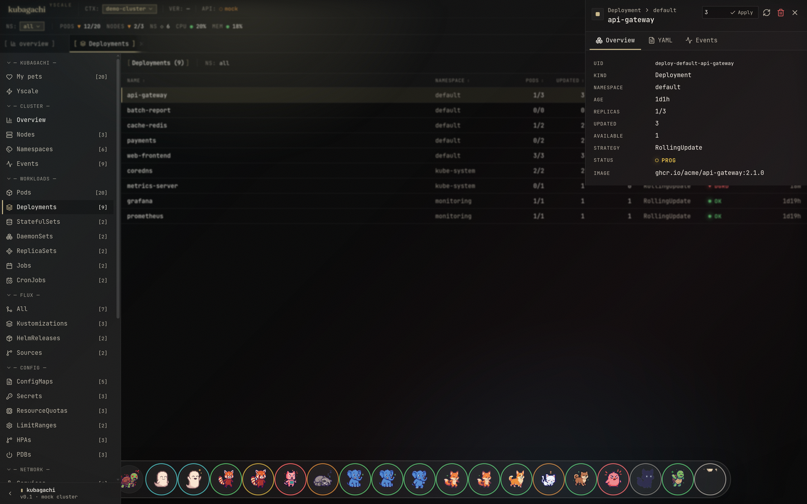
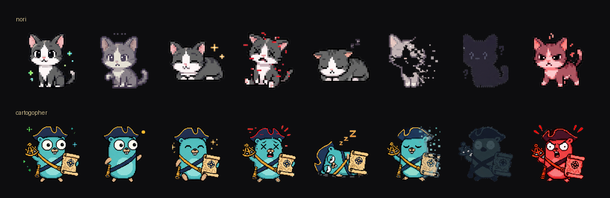

<div align="center">

# kubagachi · yscale

**Your cluster, alive.** A Kubernetes cockpit where every pod is a pixel-art
tamagotchi — k9s meets Freelens, with Flux as a first-class citizen.

[](LICENSE) &nbsp; &nbsp; &nbsp;

</div>


**kubagachi is a browser cockpit first.** `--web` serves your live cluster as a
clickable dashboard — a habitat of pixel critters whose mood **is** each pod's
health, an embedded terminal (real `kubectl exec` over a websocket), resource
drawers with edit-and-apply, and Flux as a first-class citizen. `--app` opens it
in a chromeless window.

It ships a **terminal UI too** — the same live cluster and actions as a k9s-style
TUI (`:` commands, habitat view, logs / describe / shell / delete, a dedicated
flux view) — for when you'd rather stay in the shell. One binary, both faces, one
`ClusterSource` seam underneath.

```
 /\_/\        /\_/\         _____
( o.o )      ( ?.?)       ( x.x )
 > ^ <        > ^ <        /|||\
 running      pending       RIP
```

A pod's health is its critter's mood: a content cat for `Running`, a sleepy
critter for `BackOff`, a tombstone for `CrashLoopBackOff`, a fading ghost for
`Terminating`. Restarts make them sick. You care for them with real
operations — logs, shells, deletes, flux reconciles.

## The browser cockpit

`--web` serves the same live cluster as a clickable dashboard — the full
keyboard layer, resource detail drawers, a navigable resource tree, an embedded
terminal (real `kubectl exec` over a websocket), and pixel-art critters whose
mood **is** the pod's health. The whole room reacts: a healthy cluster glows
warm, a degraded one tenses up, and sick pods get a colored halo and pulse.

**Ranch view** — press `v` to swap the habitat grid for a calm, Pokémon-ranch
layout: each node becomes a grassy platform and its pods are critters scattered
across it.


**Flux, first-class** — the `:` palette (`:flux`) opens a k9s-style view of your
GitOps state: Kustomizations, HelmReleases and sources with readiness, source
chain and revision, plus one-key reconcile / suspend. Toggle table ↔ dependency
graph.


## Run

The browser cockpit — the main way in (serves the built web app + live SSE
stream + exec websocket):

```sh
go run ./cmd/kubagachi --web            # http://127.0.0.1:8787
go run ./cmd/kubagachi --app            # same, in a chromeless app window
go run ./cmd/kubagachi --demo --web     # demo data in the browser, no cluster
```

Prefer the terminal? Drop `--web`:

```sh
go run ./cmd/kubagachi -A                # live cluster (current kubeconfig), TUI
go run ./cmd/kubagachi --demo            # demo data, TUI
```

Build:

```sh
go build -o kubagachi ./cmd/kubagachi
```

The web UI ships embedded in the binary. To rebuild it:

```sh
cd web && npm install && npm run build   # output is embedded via web/embed.go
```

## Deploy to Kubernetes (Helm)

For normal Kubernetes installs, use the Helm chart. The root `deploy.yaml` is
for Yscale's unreleased Internal Developer Platform (`idpctl`); it is not a
Kubernetes manifest, Helm values file, or supported external install path.

CI builds the image multi-arch (**amd64 + arm64**) and pushes both the image and
the Helm chart to GHCR as OCI artifacts — no external chart repo to add:

```sh
helm install kubagachi \
  oci://ghcr.io/yscale-sh/charts/kubagachi \
  --version 0.1.0 \
  --namespace kubagachi --create-namespace

# then open the cockpit
kubectl -n kubagachi port-forward svc/kubagachi 8080:80   # http://127.0.0.1:8080
```

In-cluster mode (the default) watches the cluster it runs in via the pod's
ServiceAccount — the chart provisions the cluster-read + `pods/exec` RBAC the
cockpit needs. `--set mode=demo` runs the fake habitat with no cluster access;
`--set mode=kubeconfig` targets a different cluster. See
[`charts/kubagachi`](charts/kubagachi/README.md) for all values.

Image: `ghcr.io/yscale-sh/kubagachi`. Chart:
`ghcr.io/yscale-sh/charts/kubagachi`. Both names are derived from the repo by
CI, so nothing is hardcoded.

> **About `deploy.yaml`.** That file is an internal IDP contract for a future
> one-command deploy flow through `idpctl`, reconciled by Flux on Yscale's
> platform. IDP deploys are not released for external users yet. Use Helm above
> unless you already know you are deploying through that platform.

## CLI flags

| Flag | Description |
|------|-------------|
| _(none)_ | Connect to the current kubeconfig context, terminal UI. |
| `--namespace, -n NAME` | Watch a single namespace. |
| `--all-namespaces, -A` | Watch every namespace. |
| `--context NAME` | Use a specific kube context. |
| `--demo` | Fake cluster data (no Kubernetes access). |
| `--web` | Serve the browser UI instead of the terminal UI. |
| `--web-addr HOST:PORT` | Address for `--web` (default `127.0.0.1:8787`). |
| `--app` | Open the browser UI in a native-feeling app window (implies `--web`). |
| `--pixel-critters DIR` | critterforge sprite directory (auto-detects `./critters`). |

## Terminal keybindings

| Key | Action |
|-----|--------|
| `↑ ↓ ← → / j k h` | Move the selection |
| `:` | Command mode — `pods`, `habitat`, `flux`, `events`, `ns <name>`, `all`, `quit` |
| `/` | Filter pods (name, namespace, status) |
| `v` | Toggle habitat ↔ table view |
| `f` | Flux view (kustomizations, helmreleases, sources) |
| `l` | Logs for the selected pod (tail 200, `r` to refresh) |
| `d` | Describe the selected pod (spec, conditions, events) |
| `s` | Shell into the selected pod (`kubectl exec` passthrough; bash→sh probe) |
| `ctrl+d` | Delete the selected pod (with confirm) |
| `enter` | Inspect (focus details) |
| `tab` / `e` | Cycle panes / focus events |
| `esc` | Back / clear filter |
| `?` | Help |
| `q` / `ctrl+c` | Quit |

In the **flux view**: `r` reconciles the selected object (stamps
`reconcile.fluxcd.io/requestedAt`, exactly like `flux reconcile`), `s`
suspends/resumes, `enter` shows the full status message.

## Flux, first-class

kubagachi discovers the Flux toolkit CRDs (Kustomization, HelmRelease,
GitRepository, OCIRepository, HelmRepository, Bucket) via the dynamic client
and keeps them in every snapshot: readiness, suspension, revision, source
chain and the last condition message. Both UIs surface them with reconcile /
suspend / resume actions. No Flux on the cluster? The view just says so.

## Operate, not just observe



The drawer is a full operate surface — Freelens-parity actions on the live cluster:

- **Real YAML, editable** — every resource's YAML tab shows the live object
  (`kubectl get -o yaml`, managedFields stripped) and an Edit mode that
  server-side-applies your changes back (`fieldManager: kubagachi`).
- **Secrets decoded on demand** — per-key values masked by default, with an
  eye-toggle that base64-decodes; reveal-all when you mean it.
- **CRD instances** — click any CustomResourceDefinition and browse its live
  custom resources (any third-party CRD, zero per-kind code), each with real YAML.
- **Resource actions** — delete any kind, scale Deployments/StatefulSets/
  ReplicaSets, rollout-restart Deployments/StatefulSets/DaemonSets, cordon /
  uncordon nodes. All two-step confirms.
- **Port-forward** — tunnel a pod port to the machine running kubagachi, with
  clickable `localhost:` links and stop buttons in the Pod drawer.
- **Helm releases** — the release list is decoded straight from Helm's own
  `helm.sh/release.v1` secrets (no helm binary needed to *read*); the drawer
  shows revision history, values, manifest and notes, with rollback / uninstall
  when the `helm` CLI is on the host.
- **Multi-cluster working set** — pin contexts from the switcher and flip
  between them in one click (`Ctrl+]` / `Ctrl+[`).

Writes need write RBAC: `deploy/rbac.yaml` ships the cockpit ClusterRole
(read + operate verbs + exec/port-forward) — `kubectl apply -f deploy/rbac.yaml`,
and scope it down for anything beyond a homelab.

## Security

The browser cockpit has **no built-in authentication**, and its operate surface
(edit/apply, delete, exec, port-forward, Helm) runs with whatever the pod's
ServiceAccount is granted — `deploy/rbac.yaml` ships a broad read **and write**
ClusterRole meant for a homelab. So:

- `--web` binds `127.0.0.1` by default (local only). Keep it there for solo use.
- Put an **authenticating proxy in front** of any LAN/public route — do not expose
  the write surface on an untrusted network. (This project's own dev cluster gates
  the public route with Cloudflare Access.)
- **Scope the RBAC down** (namespaces, resources, verbs; drop write) for anything
  beyond a trusted homelab, and bind a dedicated ServiceAccount.

Full hardening guide + scoped-credential recipe: **[docs/security.md](docs/security.md)**.

## Web API

`kubagachi --web` exposes the UI plus a small JSON API:

| Endpoint | Description |
|----------|-------------|
| `GET /api/snapshot` | Current cluster snapshot (pods, nodes, events, flux, helm). |
| `GET /api/stream` | Server-sent events — one snapshot per cluster change. |
| `GET /api/critters` | Sprite-sheet manifest for the pixel critters. |
| `GET /api/contexts` · `POST /api/contexts/select` | List kubeconfig contexts / switch the active one. |
| `GET /api/logs?namespace=&pod=&container=&tail=` | Pod logs. |
| `GET /api/describe?namespace=&pod=` | kubectl-describe-style summary. |
| `GET /api/object?apiVersion=&kind=&namespace=&name=` | Any object as real YAML (managedFields stripped). |
| `POST /api/object/apply` | `{yaml}` — server-side apply, any kind. |
| `GET /api/secret?namespace=&name=` | Secret data, base64 + decoded per key. |
| `GET /api/customresources?group=&version=&resource=&namespace=` | Live instances of any CRD. |
| `POST /api/pods/delete` | `{namespace,name}` — delete a pod. |
| `POST /api/resource/delete` · `/scale` · `/restart` | Generic actions: `{apiVersion,kind,namespace,name[,replicas]}`. |
| `POST /api/node/cordon` | `{name,cordon}` — (un)mark a node schedulable. |
| `POST /api/portforward/start` · `/stop` · `GET /api/portforward/list` | Pod port-forward tunnels. |
| `GET /api/helm/history` · `GET /api/helm/release` | Release revisions / values+manifest+notes (decoded from Helm storage). |
| `POST /api/helm/rollback` · `/uninstall` | Helm mutations (need the `helm` CLI on the host). |
| `POST /api/flux/action` | `{kind,namespace,name,action}` — reconcile/suspend/resume. |
| `WS /api/exec?namespace=&pod=&container=` | Interactive shell. JSON frames: `stdin`/`stdout`/`resize`/`connected`/`ping`/`exit`. |

## Connecting to a cluster

kubagachi acts with **exactly** the permissions of the credentials you give it —
there's no separate login. Three ways in:

- **Local** — standard kubectl rules: `$KUBECONFIG` if set, else `~/.kube/config`;
  `--context` picks the context (current-context by default), `-n` / `-A` the
  namespaces. It runs as *you*, so point it at a read-only context if you don't
  want the write surface live. A bad context fails fast, before the UI starts.
- **In-cluster (Helm default)** — watches its own cluster via the pod
  ServiceAccount; the chart provisions the RBAC (`rbac.*` values scope it).
- **A different cluster** — `--set mode=kubeconfig` with a scoped, read-only
  kubeconfig stored in a Secret (`kubeconfig.existingSecret`).

**→ Full walkthrough — including how to mint a scoped read-only credential and
harden the deployment — is in [docs/security.md](docs/security.md).**

## Project layout

```
cmd/kubagachi/           CLI entrypoint (TUI + web server)
cmd/critterforge/        sprite generator CLI (experimental)
cmd/critterview/         sprite gallery dev server
internal/app/            flags, ClusterSource seam, demo data, web server
internal/tui/            Bubble Tea model / update / view, Yscale styles, keys
internal/k8s/            client-go client, informers, flux watcher, actions
internal/state/          normalized cluster model (no client-go types leak out)
internal/critters/       ASCII critter registry, frames, deterministic assignment
internal/sprites/        sprite-sheet scanner shared by web + critterview
pkg/critterforge/        AI sprite generation library (Gemini-backed)
web/                     React browser UI (Vite + Tailwind), embedded via embed.go
```

The TUI never imports client-go. `app.ClusterSource` is the only seam between
data and presentation — the live informer watcher and the demo generator both
stream `state.ClusterState` snapshots over a channel, and expose the same
`Actions` surface (logs, describe, delete, exec, flux) to both UIs.

## Architecture notes

- **Channels everywhere.** Sources produce snapshots onto a buffered channel;
  informers debounce bursts (750ms). Flux CRDs are polled on a relaxed 5s
  cycle and only mark the snapshot dirty when something observable changed.
- **Frame-replace animation.** Terminal: every critter card is a fixed-size
  cell and a tick only swaps glyphs — the layout never reflows or scrolls.
  Browser: sprite sheets are pre-sliced into frames that are stacked and
  toggled (`display`), never re-fetched or repositioned.
- **Status detection** mirrors kubectl: `pod.Status.Phase`,
  `DeletionTimestamp`, waiting reasons (`CrashLoopBackOff`,
  `ImagePullBackOff`), terminated reasons (`OOMKilled`).
- **Shell passthrough** is the k9s trick: suspend the TUI, run
  `kubectl exec -it … -- sh -c 'command -v bash >/dev/null && exec bash || exec sh'`,
  restore on exit. The web terminal runs the same argv under a PTY bridged to
  xterm.js over a websocket.
- **Tested without a TTY.** `go test ./...` exercises the model lifecycle,
  rendering, search and the demo source.

## Critters, frame by frame

Each critter is a single keyed sprite sheet — eight moods in one transparent
row. These two are the regulars, Nori and Cartogopher:



Nothing repaints to animate. The UI slices the sheet into its eight frames once,
stacks them, and just toggles which one is `display: block` — so a pod's mood is
a single style flip, never a re-fetch or a re-layout. A `Running` pod sits on
frame one; a `CrashLoopBackOff` pod snaps to the angry red frame.

Even at eight frames the read is clear, and it scales with the sheet: generate
more frames and tune the swap delay, and the same frame-replace mechanism plays
them as full looping animations — idle bobs, breathing, a tail flick — straight
from whatever sheet you generate, no engine changes.

## Generating critters

The critters that ship in `critters/` were made with `pkg/critterforge` +
`cmd/critterforge` on **Gemini's image API at high quality**. Each critter is
anchored to a canonical base sprite, fed back into every frame so the mascot
stays the same character across all of its moods.

The canonical pipeline is two sheet-based stages:

```sh
# keyed status sheet — every state in one transparent row, flood-keyed to alpha
go run ./cmd/critterforge sheet  --provider gemini --quality high

# per-state animation decks (idle bob, etc.)
go run ./cmd/spriteanim          --provider gemini --quality high
```

Put a [Google AI Studio](https://aistudio.google.com/) key in `.env` at the repo
root (`GEMINI_API_KEY=…`); OpenAI's `gpt-image` works too via `--provider openai`.
Input is `critters.yaml`; PNGs + `manifest.json` are written to `./critters/`,
and cached sprites are skipped unless `--force`. Preview the gallery with
`go run ./cmd/critterview`.

```yaml
critters:
  - name: api-gateway
    mascot: white cat
    personality: poised, watchful, routes-everything-cleanly
    visual_role: API gateway / ingress pod mascot
    visual_design: [white cat body, subtle pink details, small whiskers, dark outline]
    instructions: keep the silhouette clean and readable
```

## Contributing

Contributions of all kinds are welcome — code, critters, docs, ideas. The one
rule: **use your brain and make sure it makes sense.** AI-assisted work is fine
(encouraged, even), but you own every line you submit, and every issue/PR needs a
short section written by *you*. See [`CONTRIBUTING.md`](CONTRIBUTING.md); if an
agent is doing the typing, it must follow [`AGENTS.md`](AGENTS.md). UI changes
need before/after screenshots.

## Acknowledgments

This is meant to be a happy [Freelens](https://github.com/freelensapp/freelens)-like
experience, with some [k9s](https://github.com/derailed/k9s)-like controls, and
cute characters to make Kubernetes more approachable.
