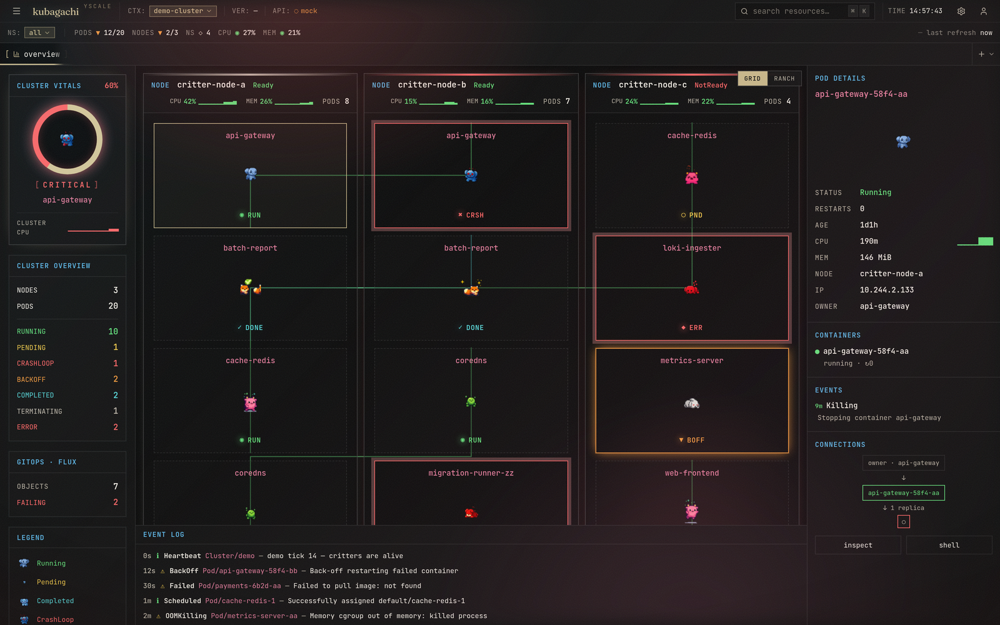
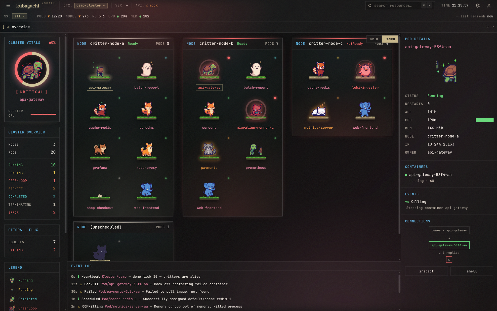
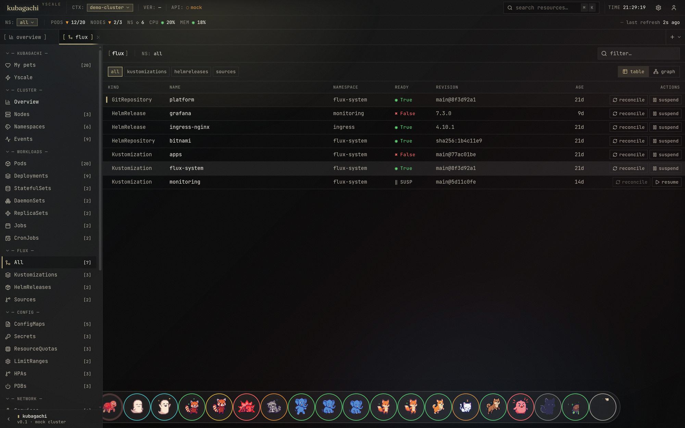

# kubagachi · yscale

Your cluster, alive. **kubagachi** is a Kubernetes cockpit where every pod is
a tamagotchi — k9s meets Freelens, with Flux as a first-class citizen.



Two faces, one binary:

- **Terminal** — a k9s-style TUI with `:` commands, habitat view, real logs /
  describe / shell / delete, and a dedicated flux view.
- **Browser** — the same live cluster as a clickable dashboard with the full
  keyboard layer, an embedded terminal (real `kubectl exec` over websocket),
  and pixel-art critters. `--app` opens it in a chromeless window.

```
 /\_/\        /\_/\         _____
( o.o )      ( ?.?)       ( x.x )
 > ^ <        > ^ <        /|||\
 running      pending       RIP
```

A pod's health is its critter's mood: a content cat for `Running`, a sleepy
critter for `BackOff`, a tombstone for `CrashLoopBackOff`, a fading ghost for
`Terminating`. Restarts make them sick. You care for them with real
operations — logs, shells, deletes, flux reconciles.

## The browser cockpit

`--web` serves the same live cluster as a clickable dashboard — the full
keyboard layer, resource detail drawers, a navigable resource tree, an embedded
terminal (real `kubectl exec` over a websocket), and pixel-art critters whose
mood **is** the pod's health. The whole room reacts: a healthy cluster glows
warm, a degraded one tenses up, and sick pods get a colored halo and pulse.

**Ranch view** — press `v` to swap the habitat grid for a calm, Pokémon-ranch
layout: each node becomes a grassy platform and its pods are critters scattered
across it.



**Flux, first-class** — the `:` palette (`:flux`) opens a k9s-style view of your
GitOps state: Kustomizations, HelmReleases and sources with readiness, source
chain and revision, plus one-key reconcile / suspend. Toggle table ↔ dependency
graph.



## Run

Demo mode (no cluster needed):

```sh
go run ./cmd/kubagachi --demo
```

Real cluster (current kubeconfig context):

```sh
go run ./cmd/kubagachi -A
```

Browser UI (serves the built web app + live SSE stream + exec websocket):

```sh
go run ./cmd/kubagachi --web            # http://127.0.0.1:8787
go run ./cmd/kubagachi --app            # same, in a chromeless app window
go run ./cmd/kubagachi --demo --web     # demo data in the browser
```

Build:

```sh
go build -o kubagachi ./cmd/kubagachi
```

The web UI ships embedded in the binary. To rebuild it:

```sh
cd web && npm install && npm run build   # output is embedded via web/embed.go
```

## CLI flags

| Flag | Description |
|------|-------------|
| _(none)_ | Connect to the current kubeconfig context, terminal UI. |
| `--namespace, -n NAME` | Watch a single namespace. |
| `--all-namespaces, -A` | Watch every namespace. |
| `--context NAME` | Use a specific kube context. |
| `--demo` | Fake cluster data (no Kubernetes access). |
| `--web` | Serve the browser UI instead of the terminal UI. |
| `--web-addr HOST:PORT` | Address for `--web` (default `127.0.0.1:8787`). |
| `--app` | Open the browser UI in a native-feeling app window (implies `--web`). |
| `--pixel-critters DIR` | critterforge sprite directory (auto-detects `./critters`). |

## Terminal keybindings

| Key | Action |
|-----|--------|
| `↑ ↓ ← → / j k h` | Move the selection |
| `:` | Command mode — `pods`, `habitat`, `flux`, `events`, `ns <name>`, `all`, `quit` |
| `/` | Filter pods (name, namespace, status) |
| `v` | Toggle habitat ↔ table view |
| `f` | Flux view (kustomizations, helmreleases, sources) |
| `l` | Logs for the selected pod (tail 200, `r` to refresh) |
| `d` | Describe the selected pod (spec, conditions, events) |
| `s` | Shell into the selected pod (`kubectl exec` passthrough; bash→sh probe) |
| `ctrl+d` | Delete the selected pod (with confirm) |
| `enter` | Inspect (focus details) |
| `tab` / `e` | Cycle panes / focus events |
| `esc` | Back / clear filter |
| `?` | Help |
| `q` / `ctrl+c` | Quit |

In the **flux view**: `r` reconciles the selected object (stamps
`reconcile.fluxcd.io/requestedAt`, exactly like `flux reconcile`), `s`
suspends/resumes, `enter` shows the full status message.

## Flux, first-class

kubagachi discovers the Flux toolkit CRDs (Kustomization, HelmRelease,
GitRepository, OCIRepository, HelmRepository, Bucket) via the dynamic client
and keeps them in every snapshot: readiness, suspension, revision, source
chain and the last condition message. Both UIs surface them with reconcile /
suspend / resume actions. No Flux on the cluster? The view just says so.

## Web API

`kubagachi --web` exposes the UI plus a small JSON API:

| Endpoint | Description |
|----------|-------------|
| `GET /api/snapshot` | Current cluster snapshot (pods, nodes, events, flux). |
| `GET /api/stream` | Server-sent events — one snapshot per cluster change. |
| `GET /api/critters` | Sprite-sheet manifest for the pixel critters. |
| `GET /api/logs?namespace=&pod=&container=&tail=` | Pod logs. |
| `GET /api/describe?namespace=&pod=` | kubectl-describe-style summary. |
| `POST /api/pods/delete` | `{namespace,name}` — delete a pod. |
| `POST /api/flux/action` | `{kind,namespace,name,action}` — reconcile/suspend/resume. |
| `WS /api/exec?namespace=&pod=&container=` | Interactive shell. JSON frames: `stdin`/`stdout`/`resize`/`connected`/`ping`/`exit`. |

## kubeconfig & contexts

Standard kubectl loading rules: `KUBECONFIG` if set, else `~/.kube/config`.
Without `--context` the current-context is used. Connection errors are
reported before the UI starts, so a bad context fails fast instead of hanging.

## Project layout

```
cmd/kubagachi/           CLI entrypoint (TUI + web server)
cmd/critterforge/        sprite generator CLI (experimental)
cmd/critterview/         sprite gallery dev server
internal/app/            flags, ClusterSource seam, demo data, web server
internal/tui/            Bubble Tea model / update / view, Yscale styles, keys
internal/k8s/            client-go client, informers, flux watcher, actions
internal/state/          normalized cluster model (no client-go types leak out)
internal/critters/       ASCII critter registry, frames, deterministic assignment
internal/sprites/        sprite-sheet scanner shared by web + critterview
pkg/critterforge/        AI sprite generation library (Gemini-backed)
web/                     React browser UI (Vite + Tailwind), embedded via embed.go
```

The TUI never imports client-go. `app.ClusterSource` is the only seam between
data and presentation — the live informer watcher and the demo generator both
stream `state.ClusterState` snapshots over a channel, and expose the same
`Actions` surface (logs, describe, delete, exec, flux) to both UIs.

## Architecture notes

- **Channels everywhere.** Sources produce snapshots onto a buffered channel;
  informers debounce bursts (750ms). Flux CRDs are polled on a relaxed 5s
  cycle and only mark the snapshot dirty when something observable changed.
- **Frame-replace animation.** Terminal: every critter card is a fixed-size
  cell and a tick only swaps glyphs — the layout never reflows or scrolls.
  Browser: sprite sheets are pre-sliced into frames that are stacked and
  toggled (`display`), never re-fetched or repositioned.
- **Status detection** mirrors kubectl: `pod.Status.Phase`,
  `DeletionTimestamp`, waiting reasons (`CrashLoopBackOff`,
  `ImagePullBackOff`), terminated reasons (`OOMKilled`).
- **Shell passthrough** is the k9s trick: suspend the TUI, run
  `kubectl exec -it … -- sh -c 'command -v bash >/dev/null && exec bash || exec sh'`,
  restore on exit. The web terminal runs the same argv under a PTY bridged to
  xterm.js over a websocket.
- **Tested without a TTY.** `go test ./...` exercises the model lifecycle,
  rendering, search and the demo source.

## Critter sprite generation (experimental)

`pkg/critterforge` + `cmd/critterforge` generate per-service pixel-art
critters with Gemini's image API — seven state sprites per critter, with the
canonical "running" sprite fed back as a reference so the character stays
consistent across moods.

1. Get a Gemini API key from [Google AI Studio](https://aistudio.google.com/)
   and put it in `.env` at the repo root: `GEMINI_API_KEY=…`
2. `go run ./cmd/critterforge generate`

Defaults read `critters.yaml` and write PNGs + `manifest.json` to
`./critters/`. Cached sprites are skipped on re-runs; `--force` re-rolls.
Preview the gallery with `go run ./cmd/critterview`.

```yaml
critters:
  - name: claude-code
    description: a cream cat holding a small sign that reads "AI"
    instructions: keep the "AI" sign visible in every state
```

## Acknowledgments

kubagachi is heavily influenced by **[Freelens](https://github.com/freelensapp/freelens)** —
the browser cockpit I love: click straight into any resource, detail drawers, a
navigable resource tree, and an embedded terminal that feels native to the page.
It also picks up some **[k9s](https://github.com/derailed/k9s)**-style terminal
flow — `:` command mode, dense live tables, and the suspend-and-`kubectl exec`
shell passthrough.

The whole point is to make Kubernetes more approachable for everyone. The
critters are ours.
