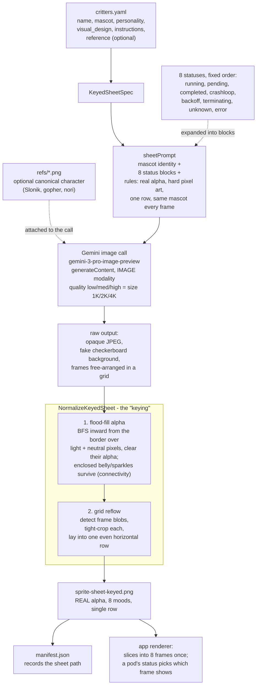

# critterforge — the keyed-sheet pipeline

How a text description in `critters.yaml` (plus an optional reference image)
becomes a game-ready, transparent, 8-mood sprite sheet. The image model is the
"artist"; the value is the deterministic post-processing that makes its output
usable.

> **See it step by step:** [critterforge by example — Nori](examples/nori/README.md)
> walks the whole pipeline as small input → output micro-examples.

## Stage notes

- **`critters.yaml` -> `KeyedSheetSpec`** — one entry per critter. `reference:`
  is optional; when present, that PNG is attached to the model call so every
  frame replicates the same character instead of being re-imagined from text.
- **`sheetPrompt`** — the master prompt: mascot identity, the 8 status blocks
  (`AllStatusBlocks()`), and hard rules (transparent alpha, hard pixel art, single
  row, no text/checkerboard, same mascot every frame).
- **Gemini call** (`gemini.go`) — plain HTTP to the `generativelanguage`
  `generateContent` endpoint, IMAGE response modality. Default model
  `gemini-3-pro-image-preview`; `--quality low|medium|high` maps to image size
  `1K|2K|4K`. Needs `GEMINI_API_KEY`.
- **`NormalizeKeyedSheet`** (`normalize.go`) — the "keying". The model returns an
  opaque image with a *baked* checkerboard (its stand-in for transparency) and
  frames in a grid. Step 1 floods alpha from the border so the background becomes
  real transparency while enclosed light regions (a belly, a sparkle) survive a
  naive color-key would punch holes in them. Step 2 detects the frames and reflows
  them into one evenly tiled row.
- **Output** — only the cleaned `sprite-sheet-keyed.png` is written; the raw grid
  never hits disk. `manifest.json` records the path; the app slices the 8 frames
  once and flips between them (a pod's mood is a style flip, not a re-render).

## The two commands

| Command | What it makes |
|---|---|
| `critterforge sheet` | the canonical **keyed status sheet** above (8 moods, one row) |
| `critterforge generate` | the older **base + derived** path: `ensureBase` makes one canonical sprite, then derives each state from it (per-state PNGs) |
| `spriteanim` (`cmd/spriteanim`) | optional stage 2: per-state multi-frame **animation decks** (idle-bob, etc.) |

Run: `critterforge sheet --only <name> --provider gemini --quality high`.

> Note: references are smooth illustrations (Slonik, the gopher), not pixel art;
> the pipeline pixel-art-ifies them. For tighter frame-to-frame consistency you can
> first convert the reference into a clean pixel-art base sprite, then anchor the
> sheet to that same-style base.
