# critterforge by example — Nori

The [critterforge pipeline](../../critterforge-pipeline.md) turns a character
into a game-ready, 8-mood sprite sheet. This page shows it **one micro-step at a
time**, on a single subject: **Nori**, the gray-and-white cat who's the shared
mascot for the whole Yscale fleet.

Each step below is a small input → output. The images are yours to reuse.

---

## 1. Input — a reference + a few words

You hand the model a reference image and a short text spec; everything
downstream keeps *this* character. Nori's reference is already clean pixel art,
so the identity is locked exactly:

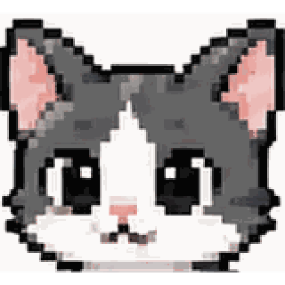

```yaml
# critters.yaml
- name: nori
  mascot: gray and white cat
  personality: calm, watchful, capable — the steady operator of the Yscale fleet
  reference: refs/nori.png            # attached to the model call
  visual_design:
    - gray-and-white chibi cat body
    - big round eyes, soft pink nose and inner ears
    - fluffy tail, small paws, crisp dark 1-2px outline
  instructions: keep Nori the SAME cat in every frame; readable at 32px
```

> The reference is optional — but when it's there, it's attached to the image
> call so every frame **replicates the same cat** instead of re-inventing it
> from the text.

---

## 2. One call → eight moods (the keyed sheet)

A single `critterforge sheet` call returns all eight Kubernetes-status moods, as
the same cat, in one row:

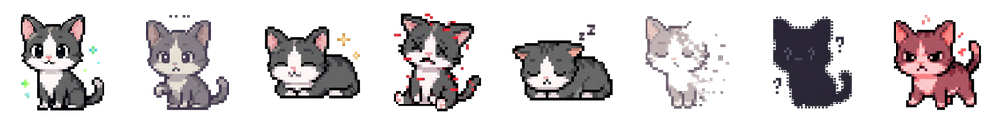

Same character, eight readable states:

<table>
<tr>
<td align="center">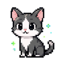<br/><code>running</code></td>
<td align="center">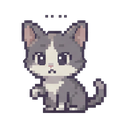<br/><code>pending</code></td>
<td align="center">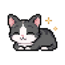<br/><code>completed</code></td>
<td align="center">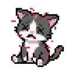<br/><code>crashloop</code></td>
</tr>
<tr>
<td align="center">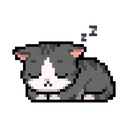<br/><code>backoff</code></td>
<td align="center">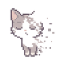<br/><code>terminating</code></td>
<td align="center">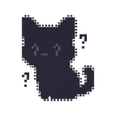<br/><code>unknown</code></td>
<td align="center">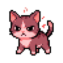<br/><code>error</code></td>
</tr>
</table>

Content and sparkly for `running`; waiting (`...`) for `pending`; curled up for
`completed`; scratched-up red for `crashloop`; asleep for `backoff`; dissolving
for `terminating`; a `?` silhouette for `unknown`; hissing red for `error`.

---

## 3. The keying — fake checkerboard → real alpha

This is the part that makes the output *usable*. The model can't emit real
transparency, so it bakes a checkerboard as its stand-in. `NormalizeKeyedSheet`
does the deterministic cleanup: it **floods real alpha inward from the border**
(so enclosed sparkles and white bellies survive — a naive color-key would punch
holes in them), then **reflows the frames into one even row**.

Proof the transparency is real — the same sheet composited over a checkerboard
*we* placed underneath. The background shows through; the cat doesn't:

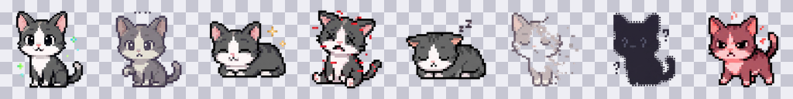

---

## 4. One mood → an animation (stage 2)

`spriteanim` takes a single mood and expands it into a multi-frame **deck** — an
idle bob, a breath, an ear twitch. One still frame becomes eight:

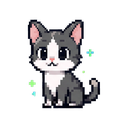  →  8-frame `running` deck:

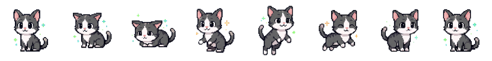

Nothing repaints to animate: the app slices the deck once and just toggles which
frame is visible.

---

## 5. Same cat, a different job (workload animations)

Here's the Nori-special. Every Yscale-family service shares the *same* mascot —
services are told apart not by a different animal, but by a **workload
animation**. When a pod is autoscaling, Nori bursts into a shadow-clone jutsu:
one cat → a hand-seal → a squad of clones → glowing cloud-portals → back to one.

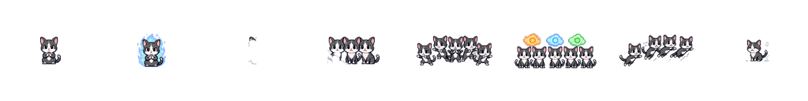

Same pipeline, same character, a new verb. `scaling`, `gpu-workload`,
`draining`, and `edge-fleet` are generated the same way — each a deck the app
plays when kubagachi sets a pod's state to that name.

---

## 6. At runtime — a state just picks a frame

In the cockpit there's no re-render. A pod flips to `CrashLoopBackOff`, and Nori
snaps to the scratched-up red frame — a single style flip, not a redraw. That's
the whole trick: **generate rich frames offline, flip between them live.**

---

### Regenerate it yourself

```sh
# stage 1 — the keyed 8-mood sheet
go run ./cmd/critterforge sheet --only nori --provider gemini --quality high

# stage 2 — per-state + workload animation decks
go run ./cmd/spriteanim       --only nori --provider gemini --quality high
```

Needs `GEMINI_API_KEY` in `.env`. Input is `critters.yaml`; output PNGs +
`manifest.json` land in `critters/nori/`. Quality is the cost dial — see
[critterforge-cost.md](../../critterforge-cost.md).
